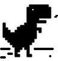

# Chrome Offline Dinosaur Game 

<p align="center">
  

### Introduction:

-	The Dinosaur Game, also known as the **T-Rex Game, Steve the Jumping Dinosaur, or Dino Runner** and initially codenamed Project Bolan, is a built-in browser game in the **Google Chrome Web Browser**. The game was created by **Sebastien Gabriel in 2014**, and can be accessed by hitting the space bar when in offline mode on Google Chrome.

### About:

-	The following represents a recreated version of the famous Dinosaur Game from Chrome Browser Offline mode implemented using **Python and PyGame**. The project file contains **Image Files** and a python script **(chromedino.py)**.
-	A simple and easy-to-use GUI is provided for better gameplay. The gameplay design is so simple that the user won’t find it difficult to use and understand. Different images are used in the development of this simple game project, the gaming environment is just like the original Chrome Dino Run game.

### Installation:

-	Step 1: **clone the repository**
```
git clone https://github.com/optimizedLP/chrome_offline_game.git
``` 
-	Step 2: download the dependencies in your Command Prompt OR Terminal using:
```
pip install requirements.txt
```

### Usage:

-	After installation, just run the [`chrome_game.py`](https://github.com/optimizedLP/chrome_offline_game/blob/master/chromedino.py) using
```
python chrome_game.py
```

### Input:

| Keys              | Actions                                                       |
|-------------------|---------------------------------------------------------------|
|  `Any Key`        |    Press any key to Start the Game.                           | 
|   **&#8593;**     |    Press `Up Arrow` to jump and avoid cacti.                  |
|   **&#8595;**     |    Press `DOwn Arrow` to duck and avoid pterodactyls.         |


### References:
-	http://www.pygame.org/docs
-	https://en.wikipedia.org/wiki/Dinosaur_Game
-	Various articles and videos.
